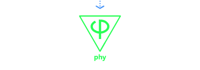

[Oimo](https://github.com/saharan/OimoPhysics/) &mdash;
[Ammo](https://github.com/kripken/ammo.js) &mdash;
[Rapier](https://github.com/dimforge/rapier.js) &mdash;
[Jolt](https://github.com/jrouwe/JoltPhysics.js) &mdash;
[Havok](https://github.com/BabylonJS/Babylon.js) &mdash;
[Physx](https://github.com/fabmax/physx-js-webidl) 
 

[START DEMO/EDITOR](https://lo-th.github.io/phy/)  
PHY Universal physics language on Worker or Direct for [three.js](https://github.com/mrdoob/three.js) 
Phy simplify game creation, is a bridge between three.js and physics. 
You can use compress or full version of physics engines. 

### phy-engine

[![NPM Package][npm]][npm-url]
[![Build Size][build-size]][build-size-url]
[![NPM Downloads][npm-downloads]][npmtrends-url]

### Features

math, pool, EnhanceLighning, ES6, chamfer geometry, compact engine, fast worker

### Usage

Phy main function is : add, remove and change. 
You can see and edit demo code directlly on [webpage](https://lo-th.github.io/phy/)

You can drag file directly on viewport ( code js or environement hdr ) 

### Todo

Add more function and demo, standardize and clean code.

### Docs

[docs](https://lo-th.github.io/phy/docs/index.html#manual/Welcome) in progress...

### About

Phy is under active development 
You can help me improve phy engine with Sponsor  

### Note

For the moment my worker source on Physx and Havok are private. 
It's a long research work to standardize all engines. 
I'm thinking opening everything but i need more Sponsors 
But is possible to use compile version without restriction.

[npm]: https://img.shields.io/npm/v/phy-engine
[npm-url]: https://www.npmjs.com/package/phy-engine
[build-size]: https://badgen.net/bundlephobia/minzip/phy-engine
[build-size-url]: https://bundlephobia.com/result?p=phy-engine
[npm-downloads]: https://img.shields.io/npm/dw/phy-engine
[npmtrends-url]: https://www.npmtrends.com/phy-engine