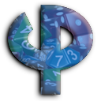

 <a href="https://lo-th.github.io/phy/"><b>START DEMO</b></a>

Phy game engine for <a href="https://github.com/mrdoob/three.js">three.js</a>, is a simple language for create and control physics engine. 
You can use direct or worker version. Phy support last version of <a href="https://github.com/saharan/OimoPhysics/">OimoPhysics</a> and <a href="https://github.com/kripken/ammo.js">Ammo.js</a>. 
And now full support of <a href="https://github.com/fabmax/physx-js-webidl">Physx 5.1</a>.

Phy simplify creation of game, is like a bridge between three.js and physics 

## Features

ES6, chamfer geometry, Glb manager, envmap and reflection, post process ...

## Usage

Phy main function is : add, remove and update. 
You can see and edit demo code directlly on <a href="https://lo-th.github.io/phy/">webpage</a> 

You can drag file directly on viewport ( code js or environement hdr ) 

## Todo

Add more demos, fixe joint...

## Docs

<a href="https://lo-th.github.io/phy/docs/index.html#manual/Welcome">docs</a> in progress...

## About

Phy is under active development 
You can help me improve phy engine with Sponsor

